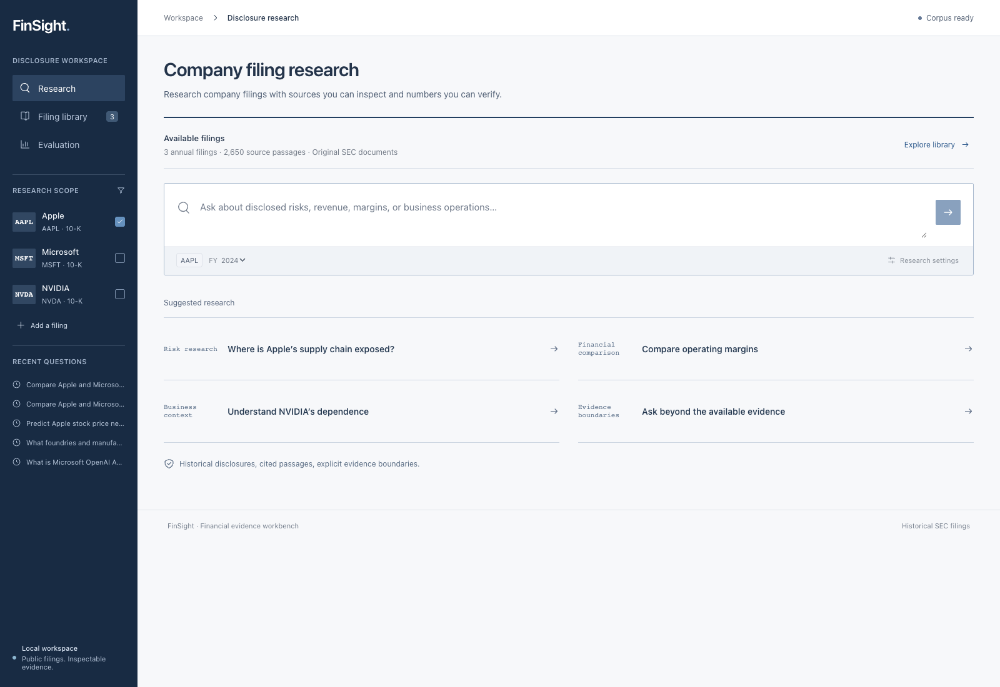
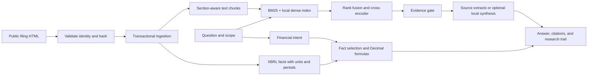
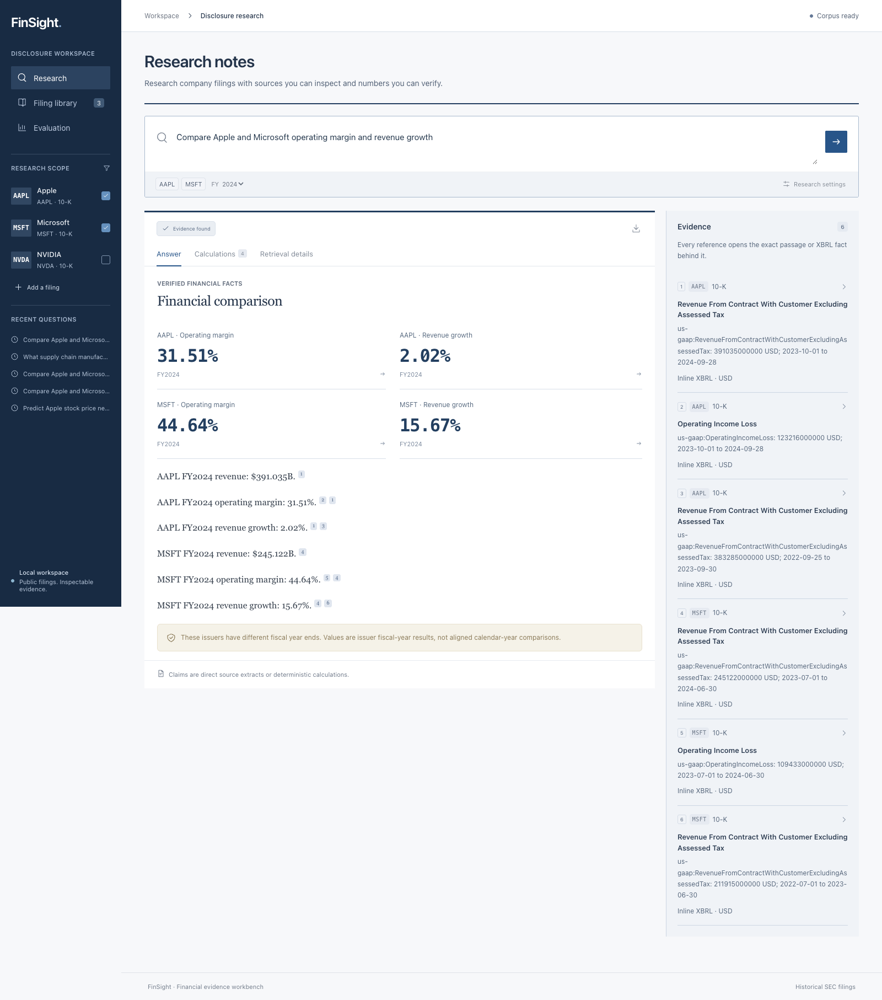
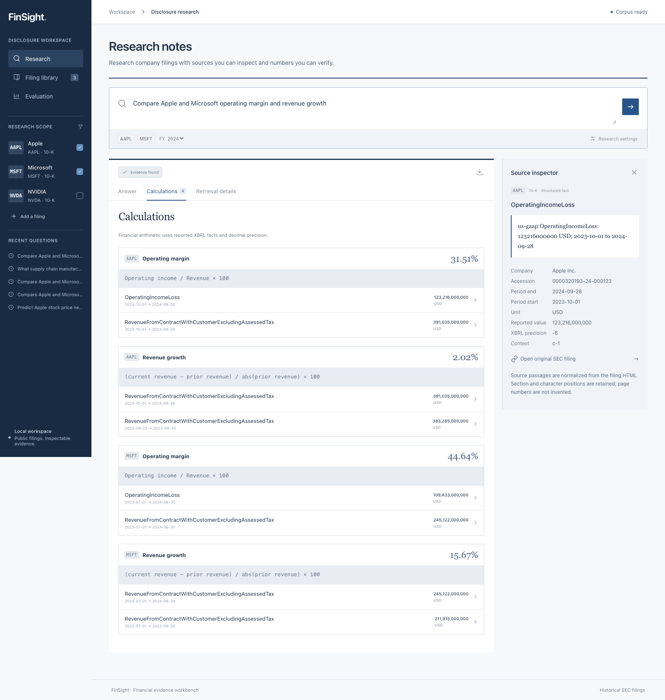
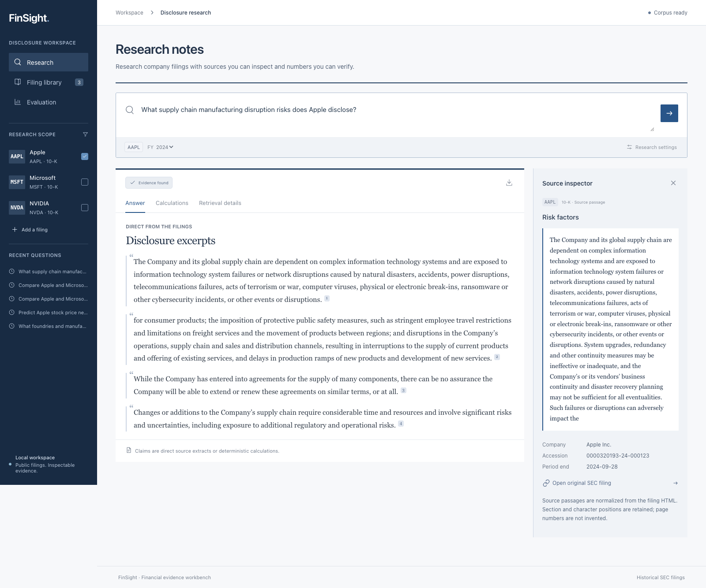
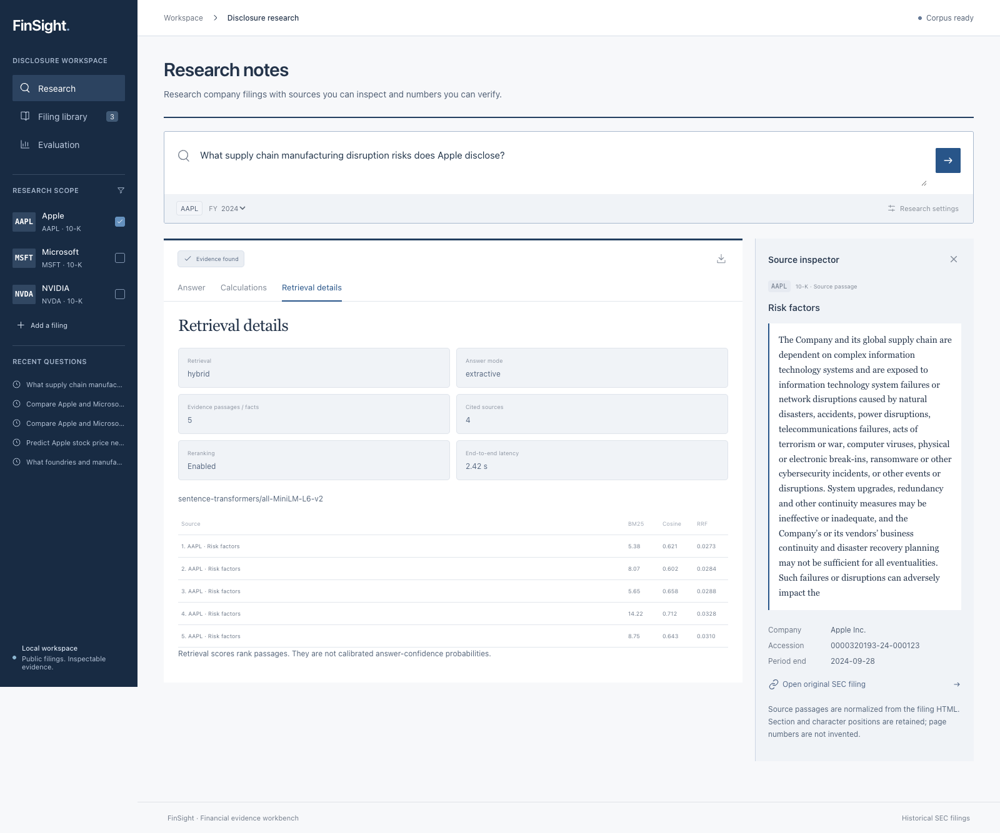
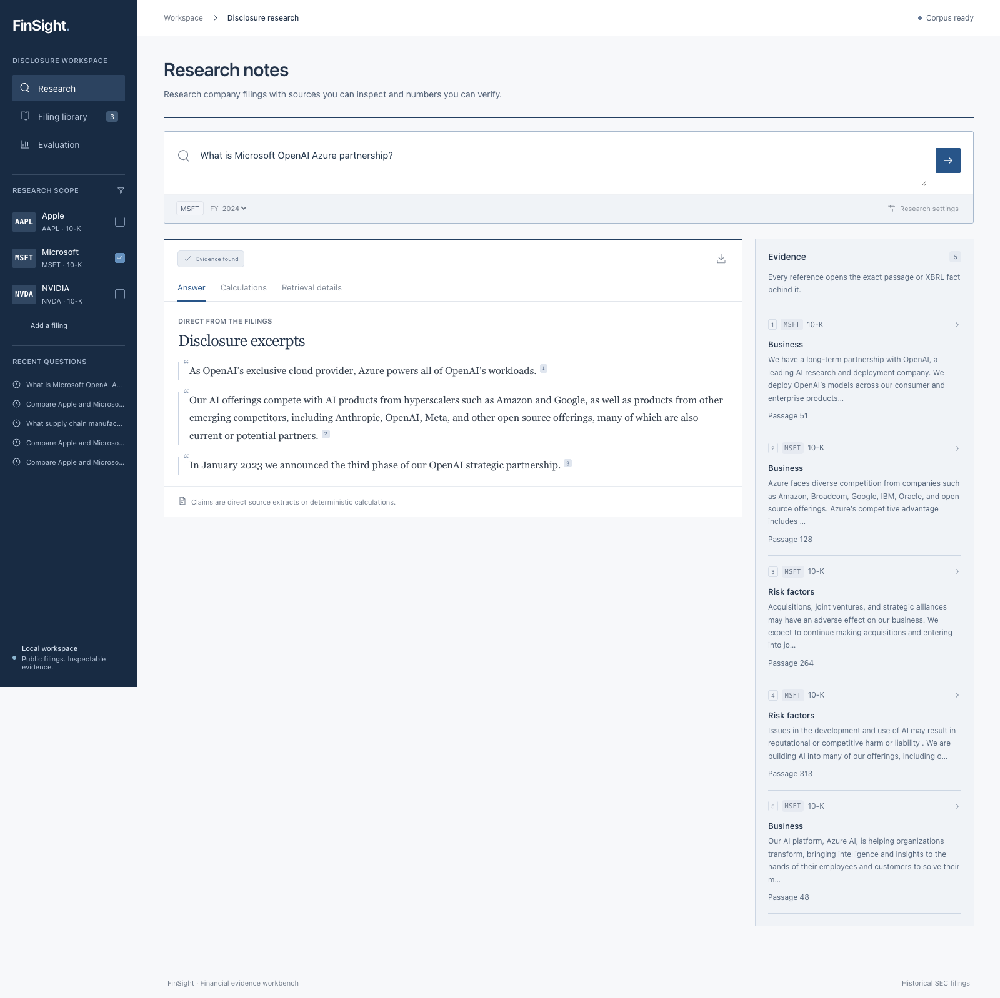
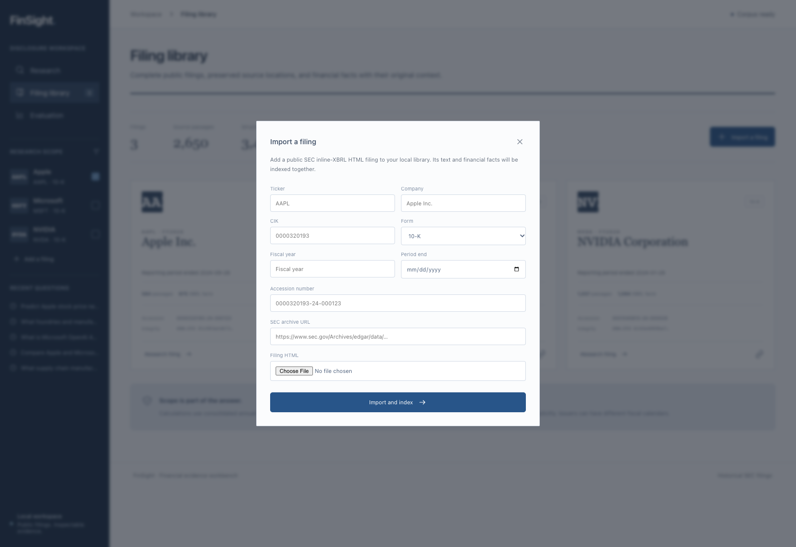
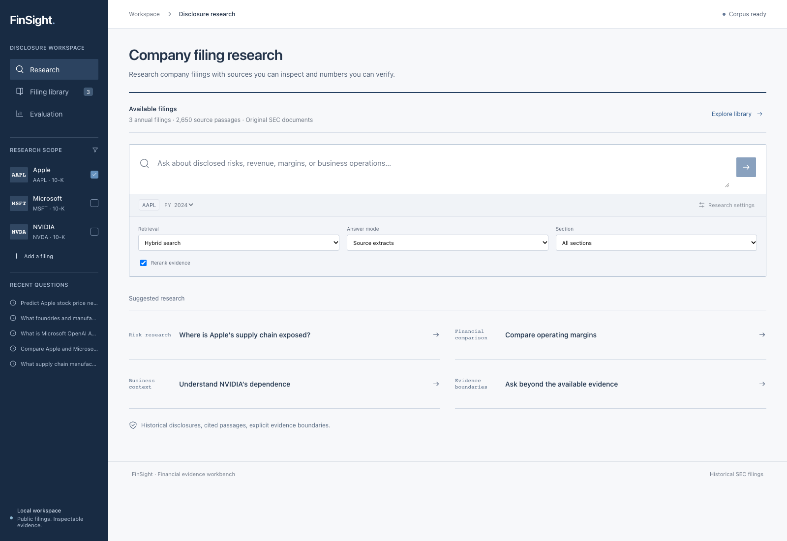
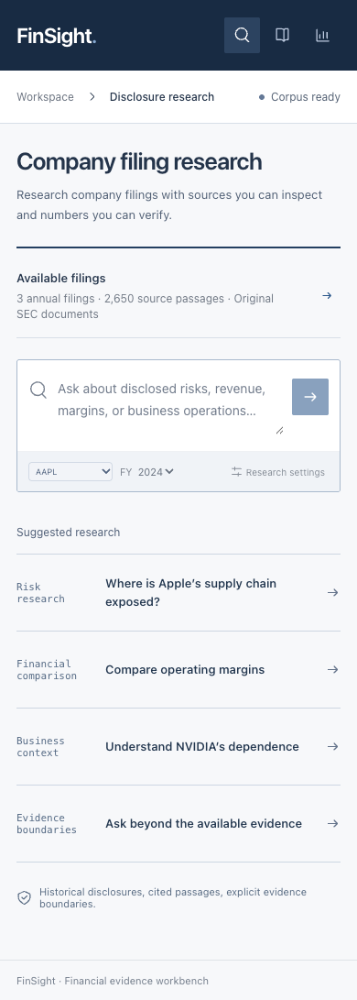

# FinSight

### Financial research with the evidence attached.

FinSight is a local workbench for researching public company disclosures. Ask a question, inspect the retrieved passages, and verify the original financial facts behind a calculation. When the selected filings cannot support an answer, the application says so.



The workspace keeps issuer selection and research history beside the question, with calculation results and source documents shown side by side.

An analyst comparing two companies needs more than a fluent answer. They need to know which filing was used, what period a number covers, whether the units match, and how a ratio was calculated. FinSight makes those decisions visible.

## Try the complete local workflow

Requirements: Python 3.12 and Node.js 22 or newer. No hosted database, API key, or cloud account is required.

```bash
python3.12 -m venv backend/.venv
backend/.venv/bin/python -m pip install --require-hashes -r backend/requirements-dev.txt
npm --prefix frontend ci
npm --prefix frontend run build
backend/.venv/bin/python scripts/prepare.py
backend/.venv/bin/python scripts/run.py
```

Open **http://127.0.0.1:8000**. The API serves the built UI and its own OpenAPI documentation at `/docs`.

Preparation imports the checked-in filing snapshots and downloads two small local ONNX models. Model files and the SQLite index live in `.local/`, outside Git. Preparation resumes unfinished embedding batches. Normal queries load cached models with network access disabled in the model loaders. Source links open the original public SEC documents only when clicked.

The default answer mode returns source extracts and deterministic financial calculations. **Optional local-model synthesis** uses Ollama; it does not silently substitute a model for the extractive mode. See [local-model configuration](docs/architecture.md#optional-local-model-synthesis).

## What you can do

- **Research disclosures:** combine BM25 keyword search and retrieval-trained MiniLM embeddings, fuse rankings, and rerank candidate passages with a local cross-encoder.
- **Inspect evidence:** open a citation to see its complete retrieved passage, filing accession, section, reporting period, and original SEC link.
- **Check the math:** inspect every ratio's formula, reported operands, USD units, and exact reporting periods. Calculations use `Decimal` rather than model-generated arithmetic.
- **Compare issuers carefully:** keep facts scoped to their issuer and filing; disclose differing fiscal calendars instead of treating fiscal years as identical calendar windows.
- **Expand the library:** import public SEC inline-XBRL HTML through the UI. Imports persist, deduplicate by accession, and resume after an API restart.
- **Revisit and export research:** reopen saved answers with their original query settings and download evidence bundles as JSON.
- **Measure retrieval:** inspect four baselines, held-out issuer results, raw source identifiers, misses, and end-to-end contract checks.

The bundled library contains complete annual filings for **Apple, Microsoft, and NVIDIA**, with **2,650 passages and 3,419 extracted XBRL facts**. Its [manifest](data/manifest.json) records source URLs, accessions, and SHA-256 hashes. These are real public disclosures; synthetic records are confined to tests.

## Example questions

| Workflow | Question | Inspect next |
|---|---|---|
| Supply-chain research | What supply chain manufacturing disruption risks does Apple disclose? | Click the inline references and read their complete passages. |
| Financial comparison | Compare Apple and Microsoft operating margin and revenue growth | Open Calculations, then inspect each operand's period and source. |
| Business relationship | What is Microsoft’s OpenAI and Azure partnership? | Follow the quoted disclosure rather than assuming current partnership terms. |
| Manufacturing dependence | What foundries and manufacturing suppliers does NVIDIA depend on? | Read the supplier passage and original filing. |
| Evidence boundary | Predict Apple stock price next year | Observe the explicit unsupported outcome with no invented prediction. |
| Financial scope | Apple revenue and EBITDA | Observe refusal to substitute a supported measure for the unsupported one. |

Select the corresponding issuer or issuers in the research scope. Questions are evaluated against imported historical filings, not live market information.

## The pipeline



Numerical questions bypass text generation. Narrative answers are direct extracts by default. Optional synthesis requires valid citation IDs and verbatim supporting quotes; those checks establish quote membership, **not** the truth of a generated paraphrase. The evidence inspector remains essential.

See [architecture and tradeoffs](docs/architecture.md), [evaluation methodology](docs/evaluation.md), and [local walkthrough](docs/walkthrough.md).

## Recorded evaluation

The [raw evaluation](evaluation/results.json) includes every case, retrieved source, score, latency, expected label, code fingerprint, and failure. Labels were committed before the baseline run. NVIDIA is reported separately as a held-out issuer. The evidence anchors are author-curated and are not exhaustive relevance judgments or externally reviewed labels.

| Retrieval method | Recall @ 5 | MRR @ 5 | Queries |
|---|---:|---:|---:|
| BM25 | 1.000 | 0.958 | 24 |
| Dense MiniLM | 0.917 | 0.710 | 24 |
| Hybrid rank fusion | 0.979 | 0.927 | 24 |
| Hybrid + cross-encoder | 1.000 | 0.938 | 24 |

**BM25 is a strong baseline on this small, specific disclosure corpus.** Hybrid reranking matches its recall and costs more inference time; these results do not establish a universal advantage for the more complex pipeline. The UI lets you compare methods.

The final recorded run also passed **45/45 financial fact/formula cases**, **14/14 unsupported-question checks**, and **10/10 exact citation-membership checks**. A [preserved earlier run](evaluation/runs/initial.json) exposed a nested metric-alias problem: “cost of revenue” also selected “revenue.” A regression test and parser correction address it. Retrieval misses and the original failed checks remain available.

These measurements describe the declared corpus and curated cases. They do not establish production reliability, broad financial coverage, answer entailment, or model accuracy on arbitrary filings. Live Ollama synthesis is not scored in this evaluation.

## Screenshots of the working application

All screenshots below were captured from the running local application with the checked-in public filings. The research desk uses navy navigation, a light document canvas, ruled result rows, and a separate evidence inspector. All numbers and source passages come from the local corpus.

### Financial comparison and calculation provenance



<details>
<summary>Formula inspector and original XBRL facts</summary>




</details>

### Research with inspectable sources


<details>
<summary>Complete source passage, retrieval details, and more company examples</summary>








</details>

### Corpus, evaluation, and evidence boundaries


<details>
<summary>Evaluation baselines, unsupported question, import, and research settings</summary>






</details>

<details>
<summary>Mobile research and comparison</summary>




</details>

## Verify and reproduce

```bash
# Unit and integration contracts; no model downloads needed.
cd backend
.venv/bin/python -m pytest
cd ..
backend/.venv/bin/ruff check backend/app backend/tests scripts --config backend/pyproject.toml
backend/.venv/bin/ruff format --check backend/app backend/tests scripts --config backend/pyproject.toml

# Real local model retrieval and end-to-end financial evaluation.
backend/.venv/bin/python scripts/evaluate.py

# Frontend build, lint, and browser checks; start the API first.
npm --prefix frontend run build
npm --prefix frontend run lint
npm --prefix frontend run test:e2e

# Refresh the screenshot gallery from the running application.
npm --prefix frontend run screenshots
```

Browser tests use installed Chrome on macOS. On other systems run `cd frontend && npx playwright install chromium`; `CHROME_PATH` can select an explicit executable. CI performs backend checks, builds the UI, prepares the corpus, runs evaluation, and checks the application in Chromium. No deployment step is configured.

## Scope and engineering tradeoffs

- SQLite transactions and WAL keep the local application small and reproducible. A single API process owns one durable import worker. Multiple API workers, authentication, tenancy, and public hosting are outside this project’s scope.
- The supported numerical registry includes ten consolidated annual USD metrics and five formulas. Quarterly/YTD facts, segment breakdowns, unsupported custom concepts, EPS, and EBITDA are not substituted or guessed.
- XBRL contexts preserve dimensions and original precision. Calculations reject conflicting values, mismatched periods/units, and zero denominators.
- Section detection is heuristic. Source anchors are retained when present; normalized text offsets and IDs support inspection. Synthetic page numbers are never presented as original document locations.
- Dense retrieval scans the filtered local corpus exactly. There is no need for approximate nearest-neighbor infrastructure at this scale. Long chunks are embedded in overlapping token windows so the encoder does not silently discard the tail.
- Financial fact checks are broader than narrative labels. More independently reviewed filings, adversarial questions, and claim-level entailment evaluation are necessary before expanding the declared coverage.

## Stack

**Python · FastAPI · SQLite · NumPy · FastEmbed / ONNX Runtime · BM25 · MiniLM · React · TypeScript · Vite · pytest · Playwright**

Public data and model references: [SEC data access](https://www.sec.gov/search-filings/edgar-application-programming-interfaces), [local FastEmbed models](https://qdrant.github.io/fastembed/examples/Supported_Models/), and [retrieve-and-rerank architecture](https://sbert.net/examples/sentence_transformer/applications/retrieve_rerank/README.html).

MIT license applies to project code. SEC filings are public source documents authored by their respective issuers; model assets retain their upstream licenses.
