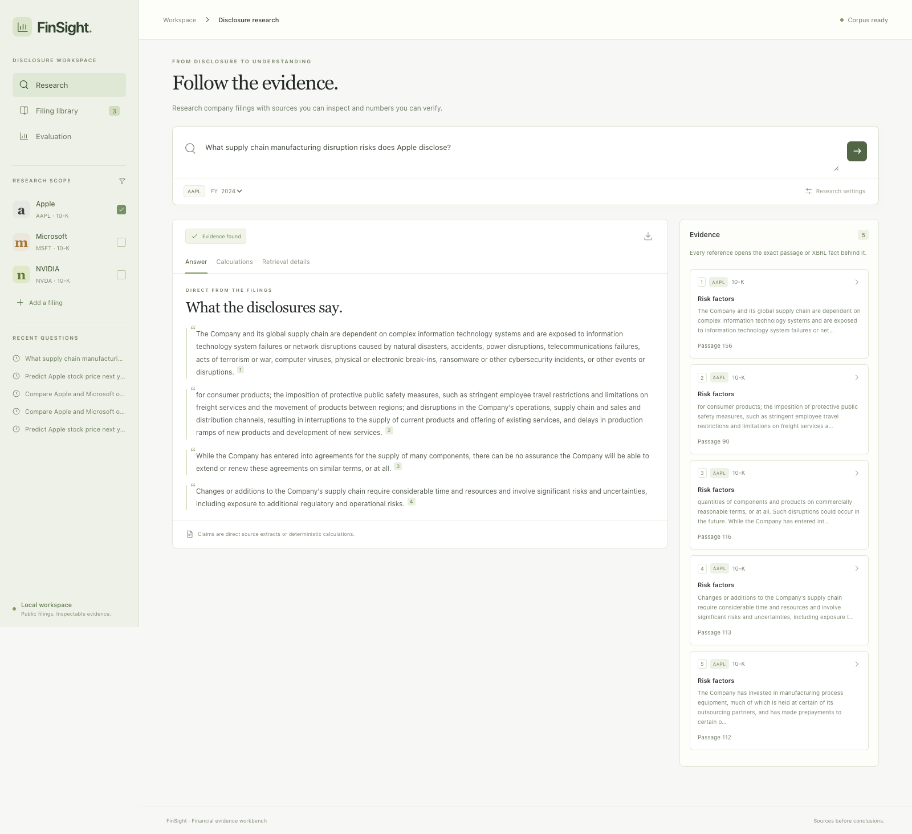
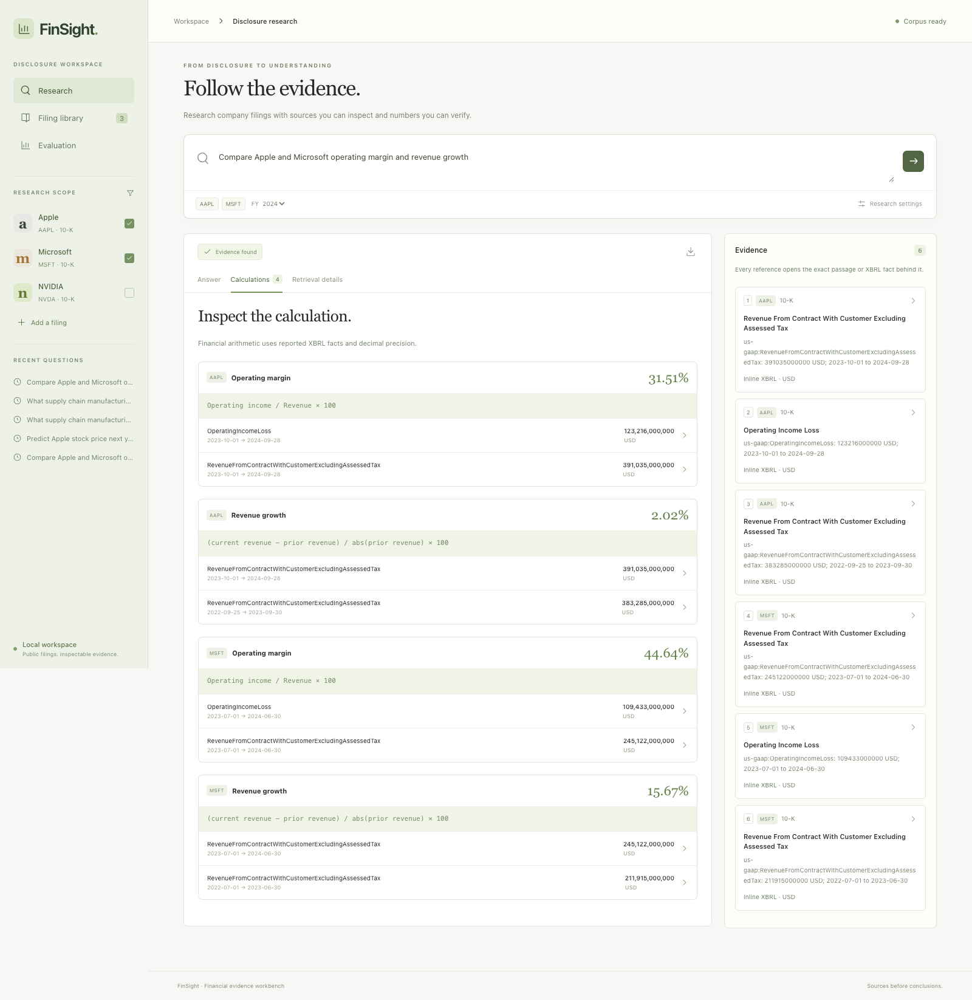
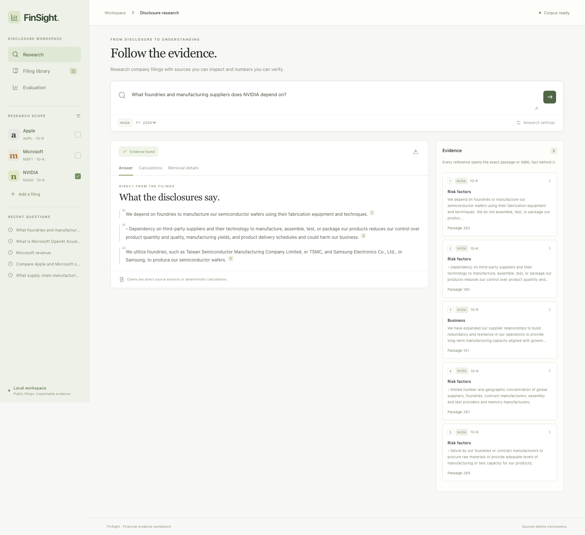
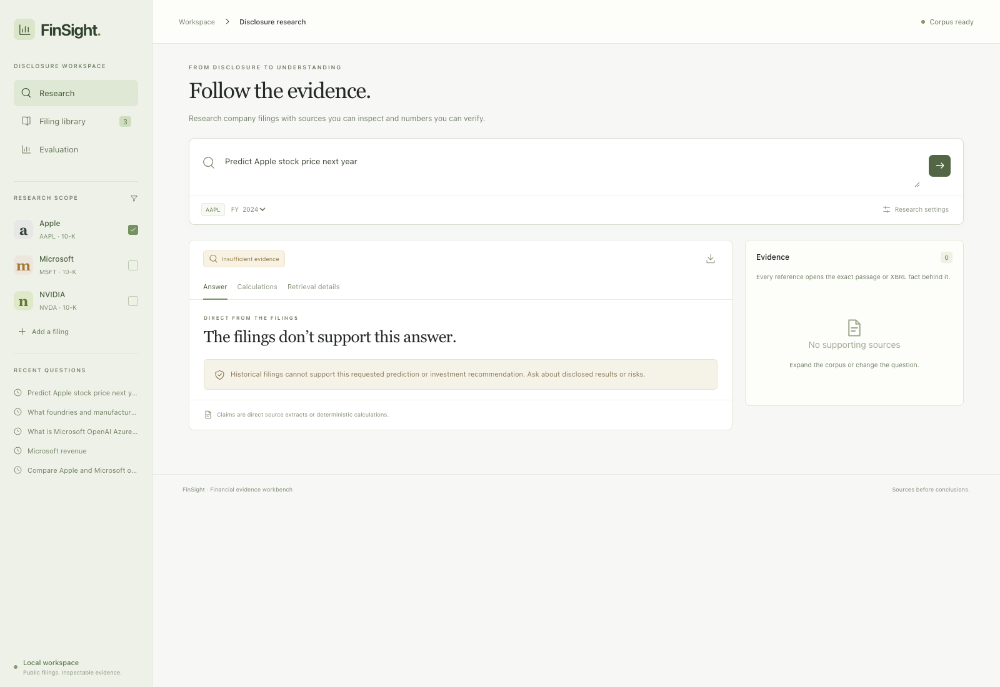
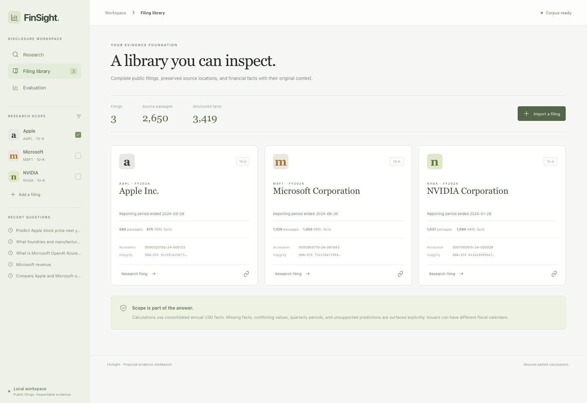
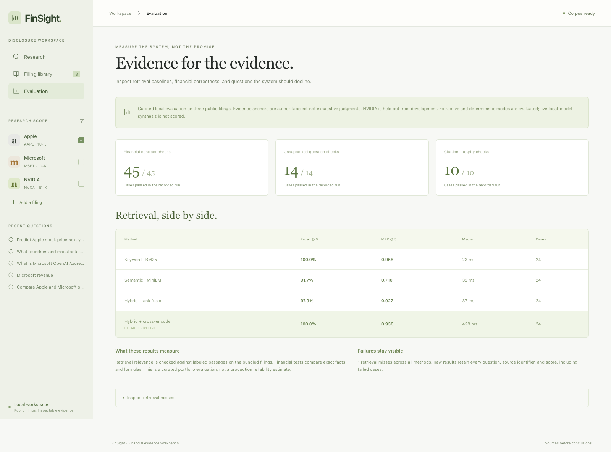
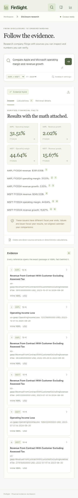

# Local walkthrough

## Research a disclosed risk

Open the workbench and choose the Apple supply-chain example. The answer is labeled as a source extract. Click an inline reference to open the complete passage, accession, section, reporting period, and original document link.

Open Retrieval details to compare the keyword, dense, and fused scores. Scores describe ranking, not answer confidence. Change the method under Research settings and rerun the same question to compare evidence selection.

## Compare figures and verify their derivation

Choose **Compare operating margins**. The workspace selects Apple and Microsoft. Each result exposes its issuer and fiscal year. The warning explains that their fiscal calendars differ.

Open Calculations. Click an operand to inspect the exact reported value, unit, concept, context ID, reporting period, and original XBRL precision. Revenue growth uses the adjacent annual comparison from the same filing.

## Inspect business context

Select Microsoft and ask about the OpenAI and Azure partnership. Select NVIDIA and ask about foundries and manufacturing suppliers. Read the cited disclosures rather than inferring current arrangements from historical documents.

## Ask an unsupported question

Choose the evidence-boundary example. A stock-price prediction is declined without fabricated supporting sources. A question that combines revenue with EBITDA also declines the unsupported measure rather than quietly substituting an available number.

## Inspect and expand the library

Filing library shows every immutable accession, source hash, chunk count, and fact count. **Import a filing** accepts a public SEC inline-XBRL HTML file and its metadata. The import remains saved while the worker parses and indexes it. An API restart resumes pending work; an explicit failure can be retried.

Reimporting the same accession and identical bytes does not duplicate the filing, even under a different proposed local ID. Changed content or conflicting metadata is surfaced.

## Evaluate, export, and revisit

The Evaluation view displays the recorded baseline run, financial checks, unsupported questions, and citation integrity checks. Expand the retrieval misses to inspect failures.

The download button on a result exports its complete evidence bundle as JSON. Recent questions survive reload and restore their original scope and research settings.

## Mobile

The light interface adapts to a narrow viewport. The issuer selector is available inside the question composer, and evidence stacks below the answer.

